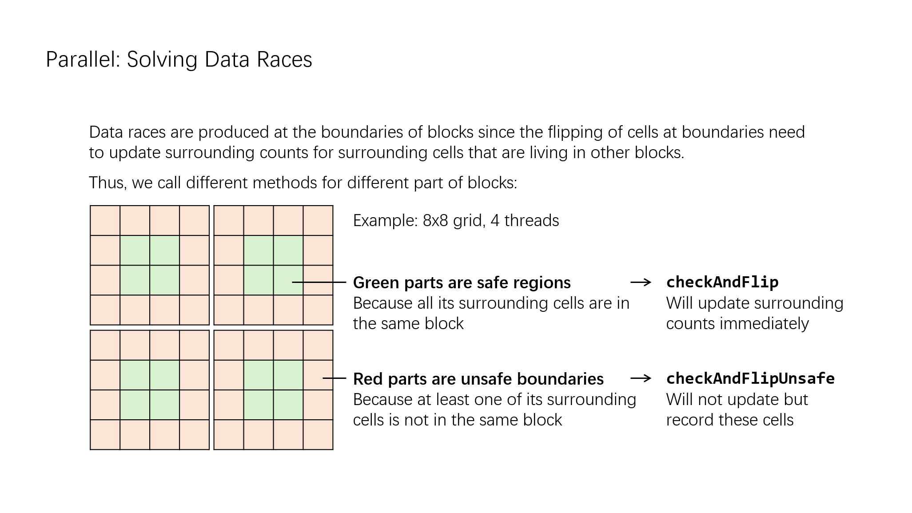
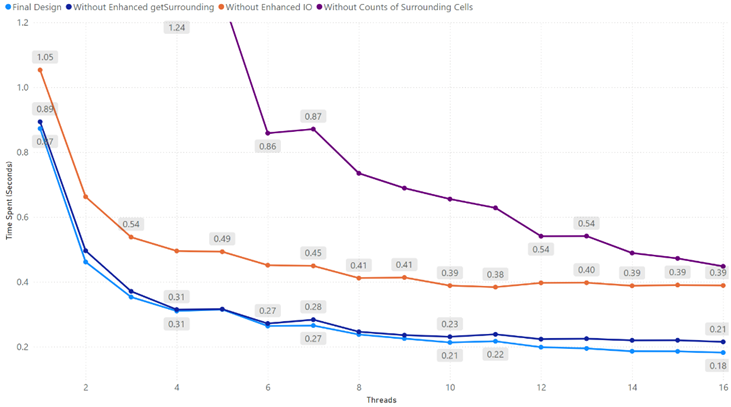

# Game of Life (Go)

> **2024 CSA Coursework | Score: 86/100 🏆**

An industrial-grade implementation of Conway's Game of Life written in **Go**, featuring a highly optimized parallel engine and a robust distributed cloud architecture. This project demonstrates advanced concurrency patterns, low-level memory optimization, and fault-tolerant distributed system design.

## 🚀 Key Highlights

### 1. Extreme Parallel Performance
Designed for maximum throughput using multi-threading and shared memory optimizations.
* **Optimized Synchronization:** Replaced standard mutexes with Condition Variables and Channels to minimize locking overhead.
* **Intelligent Block Division:** Implemented an "Unsafe Boundary" strategy. [cite_start]Workers only synchronize when processing boundary cells, allowing the majority of the grid ("Safe Regions") to be processed without locking[cite: 15, 16].
* **Non-Blocking I/O:** Decoupled I/O requests (initiate and gather) to prevent disk latency from blocking computation threads.
* **Memory Efficiency:** Reused worker goroutines and buffer slices throughout the lifecycle to eliminate Garbage Collection (GC) overhead.

### 2. Robust Distributed System (AWS)
A fault-tolerant cloud cluster capable of scaling across multiple worker nodes.
* **High Fault Tolerance:** The Broker acts as a resilient load balancer. If a worker node disconnects or fails mid-task, the system automatically detects the failure, reassigns the partition, and recovers the evaluation state without crashing.
* **High Exchange Efficiency:**
    * **Data Compression:** Implemented custom compression for matrix transmission (packing 8 pixels per byte) to minimize bandwidth usage.
    * **Exchange Graph:** Utilized a pre-calculated exchange graph to route cell updates strictly to relevant nodes, avoiding unnecessary broadcast traffic.
* **Live Visualization:** Supports real-time SDL visualization over TCP streams even in distributed mode.

## 🛠 Architecture

### Parallel Model
The distributor allocates tasks using a block division algorithm ensuring evenly sized rectangular blocks.
* **Pre-calculated Neighbor Counts:** Instead of recalculating neighbors every tick, the system maintains a dynamic 2D slice of living neighbor counts. This creates a caching mechanism that reduced computational workload by ~75% (dropping execution time from ~4s to ~0.8s).

* **Race-Free Boundary Handling:** To solve data races introduced by the caching layer without heavy locking, blocks are divided into two zones:
  
    * **Safe Regions (Green):** Central cells where all neighbors are within the local thread's block. [cite_start]These are processed and updated immediately (race-free)[cite: 48, 50].
    
    * **Unsafe Boundaries (Red):** Edge cells that share neighbors with adjacent blocks. [cite_start]Changes here are recorded separately and synchronized later to ensure data integrity.
    

  

### Distributed Model
Deployed on AWS using a Broker/Worker architecture utilizing RPC for control and TCP for data streams.
* **Broker:** Manages task dispatch, monitors node health, and handles recovery.
* **Workers:** Stateless logic nodes that can dynamically join/leave the cluster.
* **Protocol:** Custom RPC for control signals, TCP for compressed data streaming.

## 📊 Benchmarks

* **Speedup:** Parallel implementation reduced execution time for complex grids (512x512x1000) from ~4s to ~0.2s on multi-core systems.

* **Stability:** Distributed benchmarks confirm constant low-latency communication overhead regardless of thread count.

  

**For more information, please refer to [report](./report.pdf) and [viva slides](viva.pdf).**

*Created by Zik Zhao | University of Bristol, 2024*